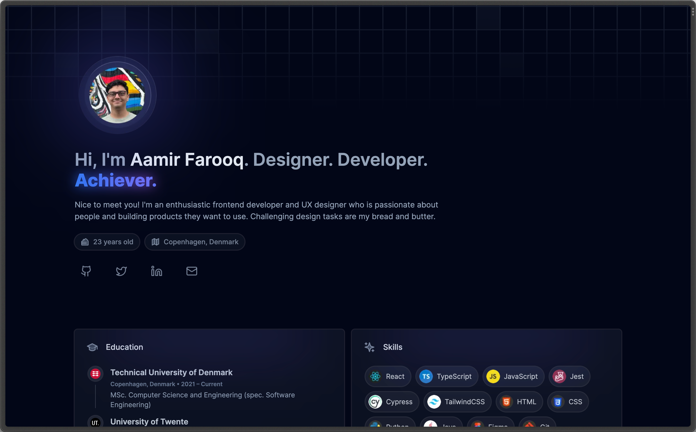
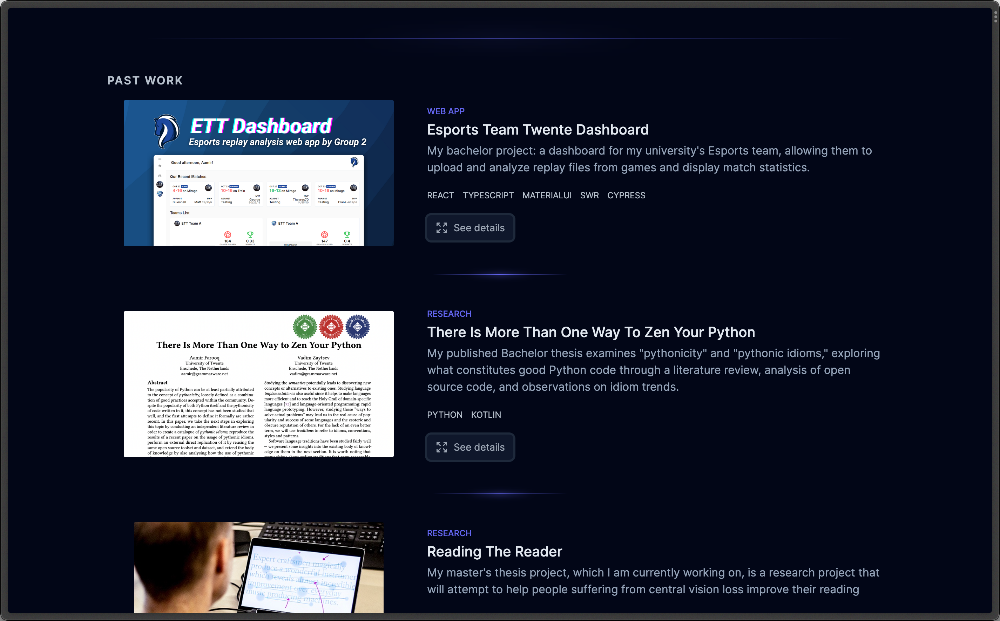
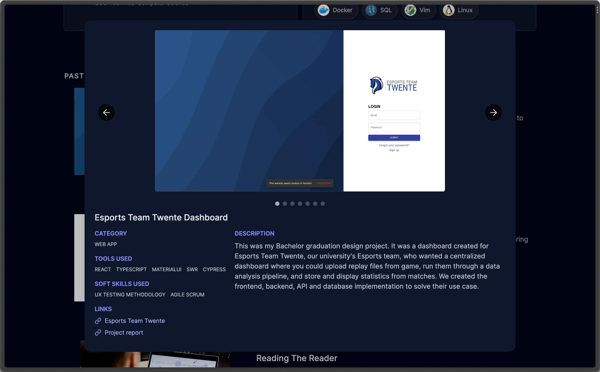

# Aamir Farooq's portfolio

This repository contains the code for my [portfolio](https://aamirfarooq.dev). This portfolio was built using [Next.js](https://nextjs.org) and [TailwindCSS](https://tailwindcss.com), and uses [Lucide Icons](https://lucide.dev/), as well as my [ESLint config](https://github.com/SlimShadyIAm/eslint-config) and [Prettier config](https://github.com/SlimShadyIAm/prettier-config).

More images can be seen in [Preview](#preview).

## Setup

To get started, you will need Node (at least v16.14.1) and a package manager of your choice, preferably `pnpm`.

1. Run `pnpm install` to install the needed dependencies.
2. `pnpm dev` to start the development server.
3. `pnpm build` to produce the optimized build for production.
4. `pnpm start` to start the server for production.

## Preview

